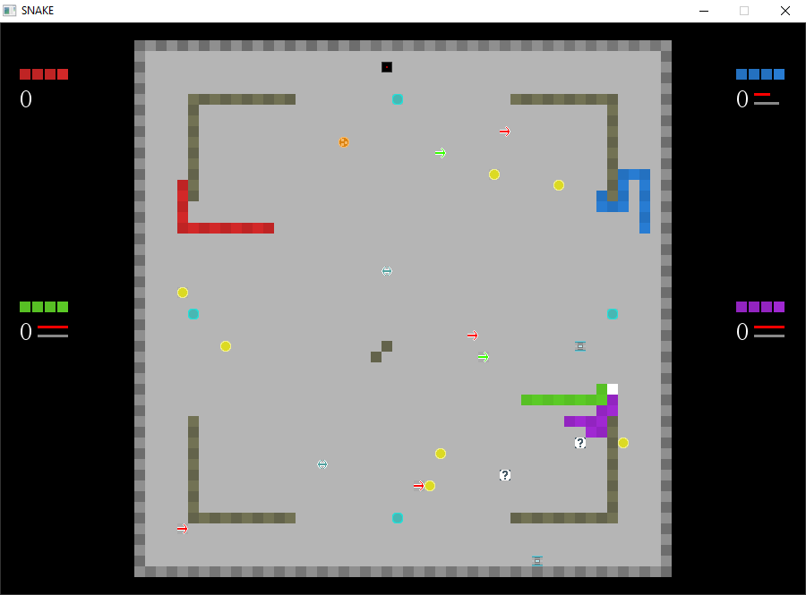

# Snake
Snake game with multiplayer &amp; AI, written in Pascal and SDL

Features:
* Acceleration, snake increasing, keyboard switch, area reducing and other stuff to collect
* From 1 to 4 players (people or BFS-based AI)
* Campaign mode
* 11 maps (you can create your own)
* 3 language versions!

**Repository already contains binary file, you can play on Windows**




## Configuration
*./conf/conf.txt*

Sample value:
```
LANGUAGE:pl.txt
FULLSCREEN:0
ROUND:3
LUCKY:2

# Comment line
```

* **Language** - possible values: *de.txt*, *en.txt*, *pl.txt*
* **Fullscreen** - *0* or *1*
* **Round** - how many rounds player needs to win the game
* **Lucky** - time between successive items drops (in seconds)